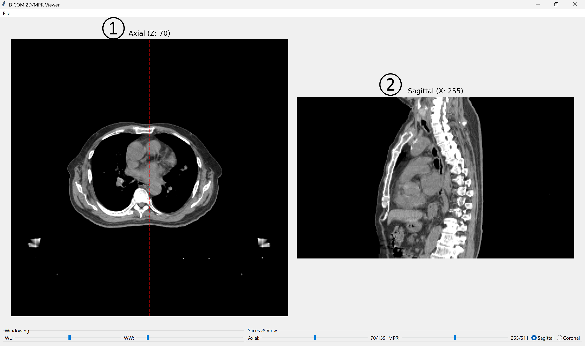
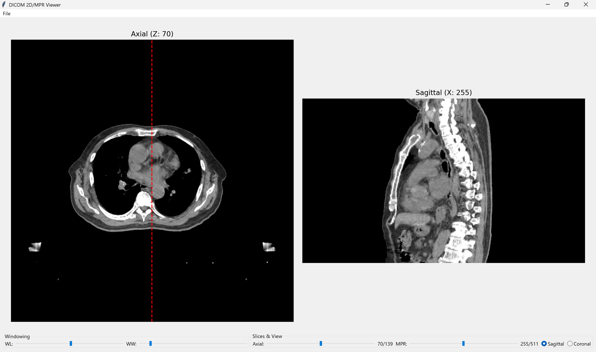
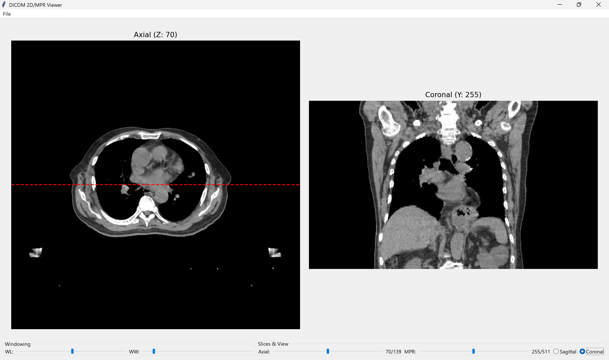

DICOMビューア 操作マニュアル
1. はじめに
このマニュアルは、DICOM画像（CT画像）を表示するためのビューアアプリの操作方法を説明します。 このアプリを使うと、元の断面（Axial）と、それを再構成した断面（SagittalまたはCoronal）を同時に見ながら、スライス位置や画質（明るさ・コントラスト）を調整できます。

2. 環境構築
このアプリを使用するには、お使いのコンピュータに Python と、いくつかの Pythonライブラリ をインストールする必要があります。

2-1. Pythonのインストール
まだPythonをインストールしていない場合は、Python公式サイトから最新版（例: 3.10以降）をダウンロードしてインストールしてください。

https://www.python.org/

重要: インストール時、「Add Python to PATH」または「PATH環境変数にPythonを追加する」というチェックボックスに必ずチェックを入れてください。

2-2. 必要なライブラリのインストール
Pythonのインストール後、以下のライブラリをインストールします。 コマンドプロンプト（Windows）またはターミナル（Mac/Linux）を開き、以下のコマンドを1行ずつ実行してください。

```bash
pip install pydicom
pip install numpy
pip install matplotlib
pip install pillow
```

3. アプリの起動方法
上記のPythonスクリプト（.pyファイル）を、PCの分かりやすい場所（例: デスクトップ）に保存します。（ファイル名例: dicom_viewer.py）

コマンドプロンプトまたはターミナルで、保存したファイルの場所に移動します。

例（デスクトップの場合）: cd Desktop

以下のコマンドを実行してアプリを起動します。

```bash
python dicom_viewer.py
```

4. 初回起動時の操作 (フォルダ選択)
アプリを起動すると、自動的に「DICOMフォルダの選択」ダイアログが開きます。

操作: あなたが表示したいCTのDICOMファイル（拡張子が .dcm のファイル）がたくさん入っているフォルダを選択し、「フォルダの選択」ボタンを押してください。

注意: ファイル単体ではなく、ファイルが入っているフォルダを選択します。

読み込みが完了すると、アプリのメイン画面に画像が表示されます。

5. 画面構成



アプリの画面は、大きく分けて「①② 画像表示エリア」と「コントロールエリア」で構成されています。

Axial（原画像）表示エリア:

CTスキャンで撮影されたそのままの断面（通常は輪切り）が表示されます。

現在、右側（②）に表示されている断面が、赤い点線で示されます。

MPR (Sagittal/Coronal) 表示エリア:

Axial画像を再構成して作られた断面（縦切りまたは横切り）が表示されます。

スライス＆ビュー (Slices & View):

Axialスライダ: ①の画像の位置を（頭側 ⇔ 足側）に動かします。

MPRスライダ: ②の画像の位置を動かします。

Sagittal/Coronalボタン: ②の断面の向き（縦切り/横切り）を切り替えます。

ウィンドウニング (Windowing):

画像の「明るさ（WL）」と「コントラスト（WW）」を調整します。

スライス番号表示:

現在のスライス番号 / 全スライス数 を表示します。

6. 基本操作
6-1. スライスを移動する
Axial（①の画像）を動かす:

「Slices & View」エリアにある「Axial」のスライダを左右にドラッグします。

左の画像（Axial）が、頭側（上）から足側（下）へ、またはその逆に移動します。

MPR（②の画像）を動かす:

「Slices & View」エリアにある「MPR」のスライダを左右にドラッグします。

右の画像（Sagittal/Coronal）が、左右または前後に移動します。

連動: このスライダを動かすと、左のAxial画像上の赤い線も一緒に移動し、今②で表示しているのが①のどの位置なのかを示します。

6-2. 断面の向きを切り替える
「Slices & View」エリアにあるラジオボタンで、②に表示する断面の向きを選べます。

Sagittal (矢状断面) を選んだ場合:

画像を**前後（縦）**に切った断面（体を横から見た図）が表示されます。

Axial（①）上の線は、縦の赤い線になります。



Coronal (冠状断面) を選んだ場合:

画像を**左右（横）**に切った断面（体を正面から見た図）が表示されます。

Axial（①）上の線は、横の赤い線になります。



6-3. 画質（明るさ・コントラスト）を調整する
「Windowing」エリアのスライダで、見たい部分（骨、肺、臓器など）に合わせて画質を調整します。

WL (Window Level) スライダ:

画像の「明るさの中心」を調整します。

右に動かすと明るい部分（骨など）が、左に動かすと暗い部分（肺など）が見やすくなります。

WW (Window Width) スライダ:

画像の「コントラスト（明暗の幅）」を調整します。

狭くする（左へ）: コントラストが強くなります（白黒がはっきりする）。脳や臓器のわずかな差を見たいときに使います。

広くする（右へ）: コントラストが弱くなります（なだらかなグレーになる）。骨から肺まで、広い範囲を同時に見たいときに使います。

調整例:

骨を見たい場合:

WL: 300 ～ 500 程度

WW: 1500 ～ 2500 程度

肺を見たい場合:

WL: -500 ～ -700 程度

WW: 1000 ～ 1500 程度

腹部（臓器）を見たい場合:

WL: 40 ～ 60 程度

WW: 350 ～ 450 程度

7. 他のフォルダを開く / 終了する
他のフォルダを開く:

アプリ左上のメニューバーから「File」→「Open DICOM Folder」を選択すると、再びフォルダ選択ダイアログが開きます。

アプリを終了する:

メニューバーから「File」→「Exit」を選択するか、ウィンドウの「×」ボタンを押します。